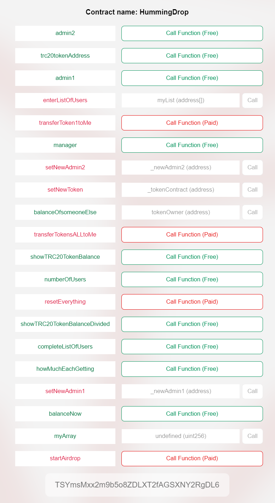

# TRC20_Token_Airdrop_Contract
TRC20 Token redistribution (Airdrop)  dapp on Tron network

A smart contract on TRON main network to equaly redistribute TRC20 tokens. 

# Running instructions:

* After deploying, the deployer gets manager rights and can add 2 more admins to use the contract.

* To use contract with your token first call function setNewToken with your trc20 token address as an argument

* Enter your users. Function enterListOfUsers() takes an array of addresses that are eligible for airdrop ["TEST6KPenCBGCxTWC7fSoAb1YrhH2wom21", "TEST6............2, ..."]

* Top-up account with your TRC20 token, by simply sending tokens to the smart contract.

* Check redistribution amount with function howMuchEachGetting()

* Call startAirdrop() function 

* Reset contract resetEverything()

## Known Issues, on Main Net. 

Use no more than 100 - 130 addresses at the time. Longer arrays take too much time for EVM to execute causing an error to be thrown and that leads for operations to fail, but the manager still ends up paying operation fees. 

